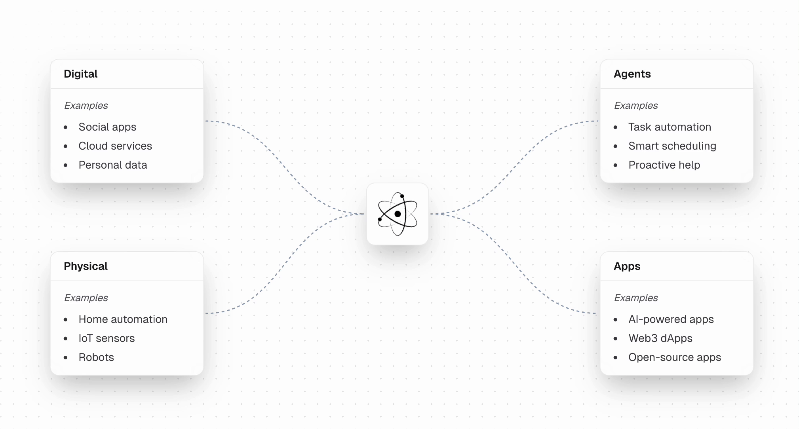

# Atom OS

Atom OS is a cross-platform operating system that is built on top of [Redox](https://www.redox-os.org/) instead of Linux. Redox is a new alternative to Linux that uses a microkernel architecture with a focus on security and performance.

The OS is a rethink of how computing should work. It is designed to be AI-powered with a focus on a new age of computing. It is built to be secure, fast and compact.

### Security

- Over half of iOS exploits are due to memory corruption bugs. These are easier to prevent with a Rust-based foundation that uses formal verification on the kernel.

- Privilege escalation is much harder to achieve with a microkernel architecture that runs drivers in userspace.

- Each program is also sandboxed and completely isolated from the main system itself.

### Cross-platform

- The OS is designed to run on any Intel/AMD, ARM and RISC-V processors for desktop, mobile, servers and embedded devices.

### Intelligence

Atom OS is designed to be AI-powered with a focus on a new age of computing.

- Full context-aware history across your data using a new file-system based on memories and documents. [SurrealDB](https://surrealdb.com/) is used to automatically index and organize your data for AI agents.

- Use natural language to interact with your digital world and physical devices. See the full list of supported connections for MCP servers [here](https://github.com/modelcontextprotocol/servers?tab=readme-ov-file#-third-party-servers) and smart home devices [here](https://matter-smarthome.de/en/overview-products-compatible-with-matter/).

- AI automations can be spawned to perform tasks on your behalf across your digital world and physical devices.

- Generative UI enables agents to control the user interface. This means that you can collaboratively interact with your computer and AI hands free.

## Supported Architectures

- x86_64
- aarch64
